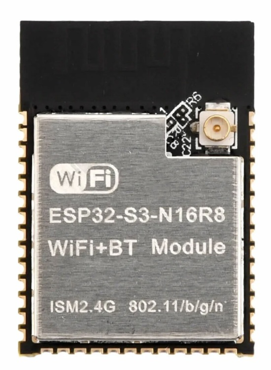
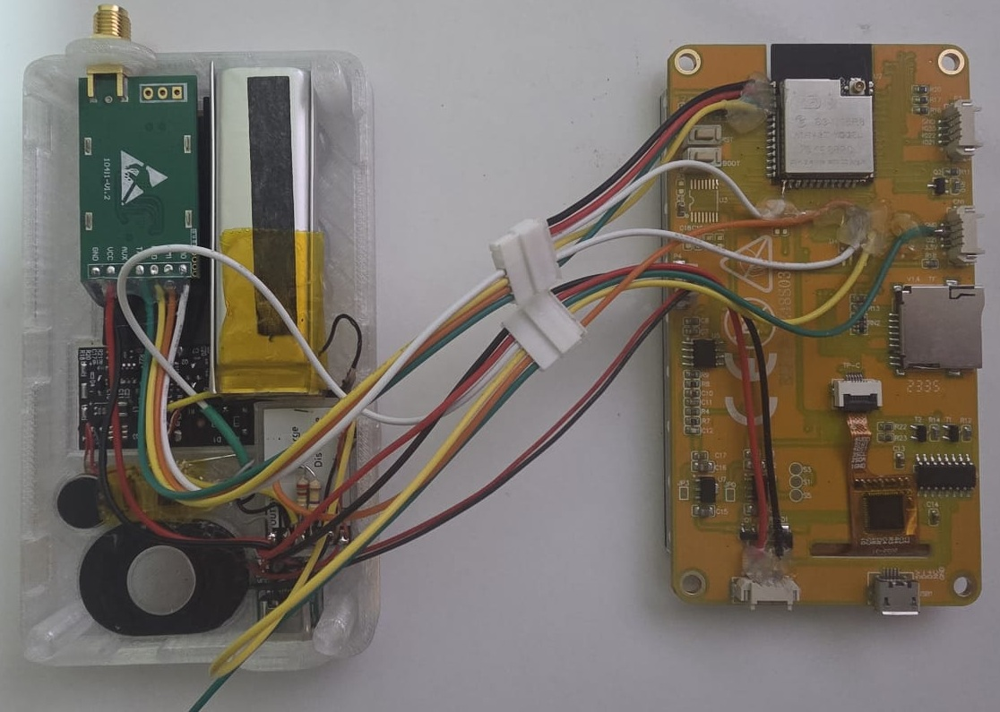
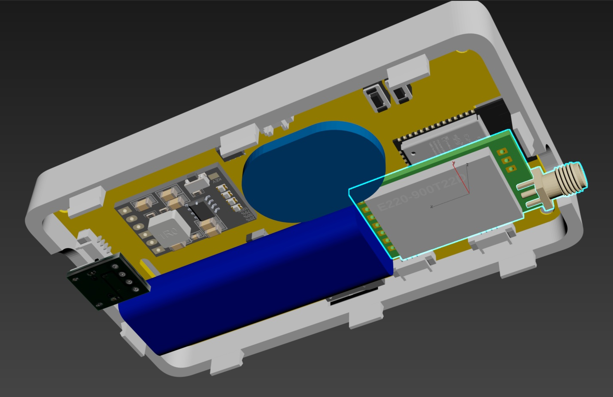
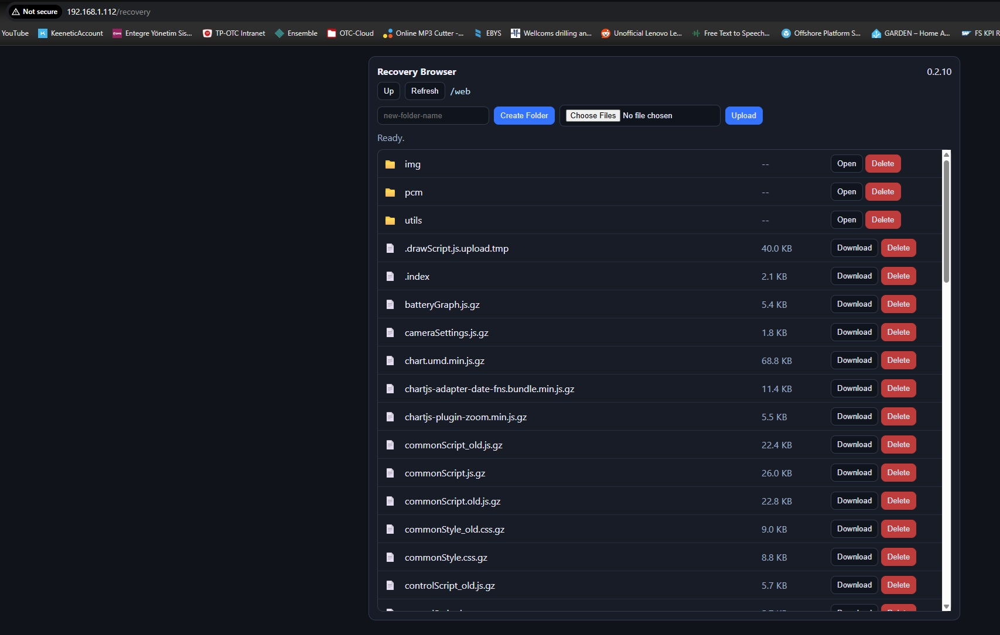
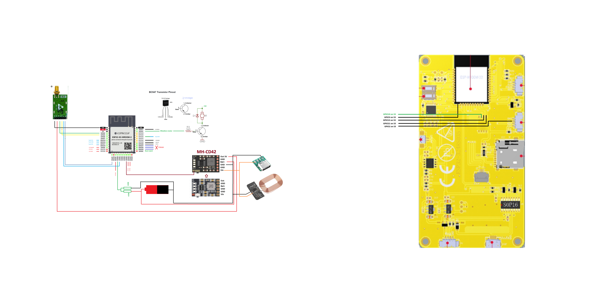

# ESP32 Touch Remote

Firmware for Sunton-style ESP32 touch display boards with an LVGL UI, Wi-Fi/AP tools, SD recovery/file access, MQTT controls, encrypted chat, and optional radio modules.

Current firmware version: **`0.21.14`**


## Supported Boards

| Board | Display | Touch | Build env |
|---|---|---|---|
| `ESP32-2432S024C` | `240x320`, `ILI9341` | `CST820` | `esp32-2432s024c` |
| `ESP32-3248S035` | `320x480`, `ST7796` | `GT911` | `esp32-3248s035` |
| `ESP32-S3-3248S035-N16R8` | `320x480`, `ST7796` | `GT911` | `esp32-s3-3248s035-n16r8` |

The `ESP32-S3-3248S035-N16R8` target is for a `3248S035` board converted to `ESP32-S3-WROOM-1-N16R8` (`16 MB flash`, `8 MB PSRAM`).

Custom PlatformIO board file:
- [`boards/esp32-s3-devkitc1-n16r8.json`](boards/esp32-s3-devkitc1-n16r8.json)

Board references used while adding `ESP32-3248S035` support:
- https://homeding.github.io/boards/esp32/panel-3248S035.htm
- https://github.com/ardnew/ESP32-3248S035

## Highlights

- Multi-board firmware selected by PlatformIO environment
- LVGL touch UI with swipe-back, reorderable menus, and double-tap screen off
- Wi-Fi station/AP setup, captive portal helpers, and SD-backed recovery browser
- Encrypted chat over LAN UDP, MQTT, and optional radio modules
- `Radio Config` with board-aware HC-12/E220 wiring, safe UART swap validation, and terminal/info tools
- `OTA Updates` includes both update-check and same-version `Reflash` on supported boards
- `Battery` screen with manual `FULL` / `DISCHARGE` training and opt-in auto calibration
- `Screen` settings for theme, timezone, 3D icons, touch feedback, screen timeout, auto power-off, and boot-time PIN lock
- Compact single-line password and PIN inputs across Wi-Fi, MQTT, and lock-screen flows
- `Radio Control` screen with saved rolling-code buttons, remote profile settings, and receiver test tools
- Home Assistant MQTT discovery for device telemetry, MQTT controls, and bidirectional chat bridge
- `Remote Control` profile screen for encrypted key, remote ID, rolling counter, and active radio module settings
- Persisted `Play sound on start` toggle with boot-time feedback
- Top-bar sound indicator/editor with volume and vibration quick controls
- Built-in `Snake`, `Tetris`, `Checkers`, and S3-only `Snake 3D`
- OTA firmware updates on the S3 target

## Photos







## Pin Mapping

### `ESP32-2432S024C`

| Group | Signal | GPIO |
|---|---|---:|
| Display | `TFT_MOSI` | 13 |
| Display | `TFT_MISO` | 12 |
| Display | `TFT_SCLK` | 14 |
| Display | `TFT_CS` | 15 |
| Display | `TFT_DC` | 2 |
| Display | `TFT_BL` | 27 |
| Touch | `TOUCH_SDA` | 33 |
| Touch | `TOUCH_SCL` | 32 |
| Touch | `TOUCH_RST` | 25 |
| Touch | `TOUCH_IRQ` | 21 |
| SD | `SD_CS` | 5 |
| SD | `SD_MOSI` | 23 |
| SD | `SD_MISO` | 19 |
| SD | `SD_SCK` | 18 |
| Audio | DAC out | 26 |
| RGB | `R / G / B` | `4 / 17 / 16` |
| Sensor | Battery ADC | 35 |
| Sensor | Light ADC | 34 |

### `ESP32-3248S035`

| Group | Signal | GPIO |
|---|---|---:|
| Display | `TFT_MOSI` | 13 |
| Display | `TFT_MISO` | 12 |
| Display | `TFT_SCLK` | 14 |
| Display | `TFT_CS` | 15 |
| Display | `TFT_DC` | 2 |
| Display | `TFT_BL` | 27 |
| Touch | `TOUCH_SDA` | 33 |
| Touch | `TOUCH_SCL` | 32 |
| Touch | `TOUCH_RST` | 25 |
| Touch | `TOUCH_IRQ` | 21 |
| SD | `SD_CS` | 5 |
| SD | `SD_MOSI` | 23 |
| SD | `SD_MISO` | 19 |
| SD | `SD_SCK` | 18 |
| Audio | DAC out | 26 |
| RGB | `R / G / B` | `4 / 17 / 16` |
| Sensor | Battery ADC | 35 |
| Sensor | Light ADC | 34 |

Notes:
- RGB is active-low.
- RGB logical red/green are swapped in software for this project.
- SD recovery SPI fallback speeds are `8 MHz`, `4 MHz`, then `1 MHz`.

### `ESP32-S3-3248S035-N16R8`

| Group | Signal | GPIO |
|---|---|---:|
| Display | `TFT_BL` | 8 |
| Display | `TFT_MOSI` | 9 |
| Sensor | Battery ADC | 10 |
| Radio | `E220 M1` | 11 |
| Touch | `TOUCH_SCL` | 15 |
| Touch | `TOUCH_SDA` | 16 |
| Touch | `TOUCH_RST` | 17 |
| Audio | output pin | 18 |
| Display | `TFT_SCLK` | 19 |
| Display | `TFT_MISO` | 20 |
| Power | shutdown signal | 21 |
| Touch | `TOUCH_IRQ` | 42 |
| SD | `SD_CS` | 38 |
| SD | `SD_SCK` | 39 |
| SD | `SD_MISO` | 40 |
| Display | `TFT_CS` | 47 |
| Display | `TFT_DC` | 48 |
| Sensor | Light ADC | 6 |
| Motor | Vibration | 2 |
| Radio | `HC-12 SET` / `E220 M2` | 3 |
| Radio | `HC-12 TX` / `E220 TX` | 4 |
| Radio | `HC-12 RX` / `E220 RX` | 5 |

S3 notes:
- RGB output is disabled because the original remap conflicts with octal PSRAM pins on `ESP32-S3-WROOM-1-N16R8`.
- Audio backend is currently disabled in firmware on S3 because the existing internal DAC path is ESP32-only.

Reference:


## Radio Module Wiring

### `HC-12` on `ESP32-2432S024C` / `ESP32-3248S035`

| Signal | ESP32 GPIO |
|---|---:|
| `RXD` | 1 |
| `TXD` | 39 |
| `SET` | 22 |

Reference:


### `HC-12` on `ESP32-S3-3248S035-N16R8`

| Signal | ESP32-S3 GPIO |
|---|---:|
| `RXD` | 4 |
| `TXD` | 5 |
| `SET` | 3 |

Reference:


### `Ebyte E220-400T22D` on `ESP32-S3-3248S035-N16R8`

| Signal | ESP32-S3 GPIO |
|---|---:|
| `RX` | 4 |
| `TX` | 5 |
| `M1` | 11 |
| `M2` | 3 |

Reference:



Radio notes:
- `HC-12` chat/discovery works normally.
- `E220` chat/discovery works in `Transparent` mode.
- `E220 Fixed` mode is available for module configuration, but current chat/discovery transport is disabled there.
- Radio encryption is shared across both modules.
- On `ESP32-2432S024C` and `ESP32-3248S035`, HC-12 wiring is fixed to `TX1`, `RX39`, `SET22`; invalid saved UART swaps are cleared automatically at boot.
- On the S3 build, `Radio Config` can swap `RX/TX` for both modules and `M0/M1` for `E220` if wiring was cross-connected.
- Radio pin-swap settings are stored in NVS and restored after reboot when the resulting GPIO map is valid.
- `Radio Terminal` shows example test commands for the selected module.

## Battery and Power

- Battery range: empty `3.30V`, full `4.20V`
- Default calibration factor fallback: `0.96`
- On S3, battery sense expects a `470K / 220K` divider into `GPIO10`
- `Config -> Battery` supports:
  - `Reset`
  - manual `FULL`
  - manual `DISCHARGE`
  - opt-in `Auto Calibration`
- Background battery auto-learning runs only after the user explicitly enables `Auto Calibration`
- Manual training can temporarily force `Power Off` to `Never`, then restore the previous user setting
- S3 hardware power-off pulse is driven on `GPIO21`
- Battery ADC on S3 now falls back to raw ADC scaling if `analogReadMilliVolts()` returns zero

## Defaults

### Network

- AP password: `12345678`
- Boot STA reconnect timeout: `12000 ms`

| Board | AP SSID | mDNS host |
|---|---|---|
| `ESP32-2432S024C` | `ESP32-2432S024C-FM` | `esp32-2432s024c` |
| `ESP32-3248S035` | `ESP32-3248S035-FM` | `esp32-3248s035` |
| `ESP32-S3-3248S035-N16R8` | `ESP32-S3-3248S035-FM` | `esp32-s3-3248s035` |

### MQTT

- Enabled: `false`
- Broker: `homeassistant.local`
- Port: `1883`
- Discovery prefix: `homeassistant`

### Custom Home Assistant Integration

- Integration: `MQTT Remote Buttons Remap`
- Repository: https://github.com/elik745i/MQTT-Remote-Buttons-Remap
- Purpose: remap ESP32 remote MQTT button actions to existing Home Assistant services and button entities
- Install and configuration guide: https://github.com/elik745i/MQTT-Remote-Buttons-Remap

## UI and Feature Notes

- Double-tap while awake turns the screen off
- Wake taps are consumed before normal UI input resumes
- Swipe-back and scroll gestures suppress accidental button clicks
- `Screen` includes button themes, timezone, 3D icons, touch feedback, screen timeout, power-off timeout, and optional 4-digit boot PIN lock
- `Radio Control` can store reusable rolling-code buttons and includes a dedicated `Receiver Test` screen
- `Remote Control` lets you save the active remote module profile, encryption key, remote ID, and rolling counter
- Top bar can show Wi-Fi, MQTT, unread chat, sound mode, and battery
- `Chat` supports pairing, unread markers, local/MQTT/radio transport, and SD-backed history under `/Conversations`
- `Checkers` supports local play and chat-started multiplayer invites
- `Snake 3D` is available on the S3 target only

## SD Layout

- `/web` for static web UI assets
- `/Conversations` for chat history

Recovery/file APIs can browse and manage rooted SD paths.

## Build and Flash

### Requirements

- PlatformIO Core
- USB serial access to the board

### Build environments

- `esp32-2432s024c`
- `esp32-3248s035`
- `esp32-s3-3248s035-n16r8`

### Build

```powershell
pio run
```

### Build a specific target

```powershell
pio run -e esp32-2432s024c
pio run -e esp32-3248s035
pio run -e esp32-s3-3248s035-n16r8
```

### Flash

```powershell
pio run -e esp32-s3-3248s035-n16r8 -t upload
```

`pio run -t upload` writes the full image layout for the selected environment. Use that when flashing from source.

### Flash a GitHub release binary

Do not flash only `firmware.bin` on `ESP32-2432S024C`. That board needs the full release image set written at the correct offsets or it can boot to a blank screen.

For the latest verified release (`v0.21.14`), download these four files from:

- `https://github.com/elik745i/ESP32-2432S024C-Remote/releases/tag/v0.21.14`

For `ESP32-2432S024C`, use:

- `esp32-2432s024c-v0.21.14_bootloader.bin` at `0x1000`
- `esp32-2432s024c-v0.21.14_partitions.bin` at `0x8000`
- `esp32-2432s024c-v0.21.14_boot_app0.bin` at `0xE000`
- `esp32-2432s024c-v0.21.14.bin` at `0x10000`

Using Espressif `Flash Download Tool` on Windows:

1. Download `flash_download_tool.zip` from `https://dl.espressif.com/public/flash_download_tool.zip`
2. Run `flash_download_tool_3.9.9_R2.exe`
3. Select the four `ESP32-2432S024C` release files in the order listed above
4. Enter the matching offsets: `0x1000`, `0x8000`, `0xE000`, `0x10000`
5. Pick the board's COM port and press `START`

Example `Flash Download Tool` layout:


If you use `esptool.py`, the equivalent command is:

```powershell
esptool.py --chip esp32 --port COMx --baud 460800 write_flash -z `
  0x1000 esp32-2432s024c-v0.21.14_bootloader.bin `
  0x8000 esp32-2432s024c-v0.21.14_partitions.bin `
  0xE000 esp32-2432s024c-v0.21.14_boot_app0.bin `
  0x10000 esp32-2432s024c-v0.21.14.bin
```

`ESP32-3248S035` uses the same `ESP32` flash layout as `ESP32-2432S024C`:

- `bootloader` at `0x1000`
- `partitions` at `0x8000`
- `boot_app0` at `0xE000`
- `firmware` at `0x10000`

`ESP32-S3-3248S035-N16R8` release assets support full `Flash Download Tool` flashing too:

- `bootloader` at `0x0000`
- `partitions` at `0x8000`
- `boot_app0` at `0xE000`
- `firmware` at `0x10000`

### Serial monitor

```powershell
pio device monitor -b 115200
```

Some boards or USB adapters may require manual bootloader entry:
1. Hold `BOOT`
2. Press and release `RST` or `EN`
3. Release `BOOT` when upload starts

## OTA

- `ESP32-S3-3248S035-N16R8` supports firmware OTA with the stock `16 MB` dual-slot layout
- The two `4 MB` ESP32 targets do not support firmware OTA flashing

## Partitions

- `ESP32-2432S024C` and `ESP32-3248S035` use [partitions_3mb_no_ota.csv](partitions_3mb_no_ota.csv)
- `ESP32-S3-3248S035-N16R8` uses Espressif `default_16MB.csv`

## Useful Endpoints

| Method | Path | Purpose |
|---|---|---|
| `GET` | `/version` | Firmware version |
| `GET` | `/` | Main web UI or setup redirect |
| `GET` | `/wifi` | Wi-Fi setup page |
| `GET` | `/recovery` | Recovery browser |
| `GET` | `/api/wifi/scan` | Wi-Fi scan results |
| `POST` | `/api/wifi/connect` | Connect to Wi-Fi |
| `GET` | `/api/telemetry` | Battery, light, Wi-Fi snapshot |
| `GET` | `/api/chat/messages` | Current conversation window |
| `GET` | `/api/chat/peers` | Trusted peers |
| `GET` | `/fs/list` | SD file listing |
| `GET` | `/sd_info` | SD status and recovery counters |

## Project Structure

- [src/main.cpp](src/main.cpp) - main firmware logic
- [platformio.ini](platformio.ini) - PlatformIO environments
- [partitions_3mb_no_ota.csv](partitions_3mb_no_ota.csv) - 4 MB ESP32 partition map
- [documents](documents) - schematics, photos, and reference files
- [3D_Models](3D_Models) - enclosure files
- [release_assets](release_assets) - staged release binaries and notes

Home Assistant integration repository: https://github.com/elik745i/MQTT-Remote-Buttons-Remap

## Releases

GitHub Releases contain published firmware binaries for each supported target.

## v0.21.14

- Deferred Wi-Fi, MQTT, OTA, and radio startup work so the UI becomes responsive earlier after boot.
- Kept the selected remote radio profile active in RAM for `Radio Control`, removed the send-time restore churn, and fixed HC-12 receiver-test/profile reapply handling.
- Added a `15 sec` timeout option to `Power Off` and `Deep Sleep` screen settings.
- Deep-sleep timeout now puts the active radio module to sleep first, works while charging, and is available on the `ESP32-S3-3248S035-N16R8` target too.

## v0.21.13

- Added `Config Password` under `Config -> Screen`, defaulted to PIN `1111`, and require the current PIN before disabling either `Config Password` or `Screen Lock`.
- Removed the screenshot feature and cleaned up `Main Screen Items` so `Config` and `Power` stay available without separate visibility toggles.
- Fixed duplicate radio-control sends for gate and momentary actions, and keep the bundled Radio pack installed by default on `ESP32-2432S024C`.
- Hardened radio startup by auto-clearing invalid saved UART swaps and clarified the fixed HC-12 wiring shown on compact ESP32 boards.

## v0.21.12

- Added `Deep Sleep` under `Config -> Screen` for the non-S3 ESP32 boards, with the same timeout workflow as `Power Off`, RGB shutdown before sleep, and best-effort HC-12 sleep handling.
- Made `Radio Control -> Button Config` horizontally scrollable on `ESP32-2432S024C` and added an on-screen sideways swipe hint so the right-side toggle and confirmation controls stay reachable.
- Normalized persisted remote-control keys, made bundled module packs install immediately even while the GitHub catalog is still refreshing, and keep module action buttons usable during catalog refresh.
- Updated `Receiver Test` so it configures the receiver from the saved `Config -> Remote Control` profile across boards and shows the active HC-12 or E220 settings in the UI.

## v0.21.11

- Restored the main-screen `Power` entry on the non-S3 ESP32 targets while keeping actual hardware shutdown safely gated to boards that support it.
- Fixed Wi-Fi scan servicing, added visible `Searching...` progress with `Scan`/`Stop`, and stop scans automatically when leaving the screen.
- Kept the on-screen keyboard anchored at the bottom on compact layouts and close the Wi-Fi password popup immediately after `Save`.
- Made `Config -> Modules` non-blocking and cancelable, with bundled catalog and package fallback so modules remain installable on plain ESP32 boards even when live GitHub HTTPS fetches fail.

For `ESP32-2432S024C`, release flashing requires the full set of release assets:

- `bootloader`
- `partitions`
- `boot_app0`
- `firmware`

Flashing only the main firmware binary is not sufficient on that board.
