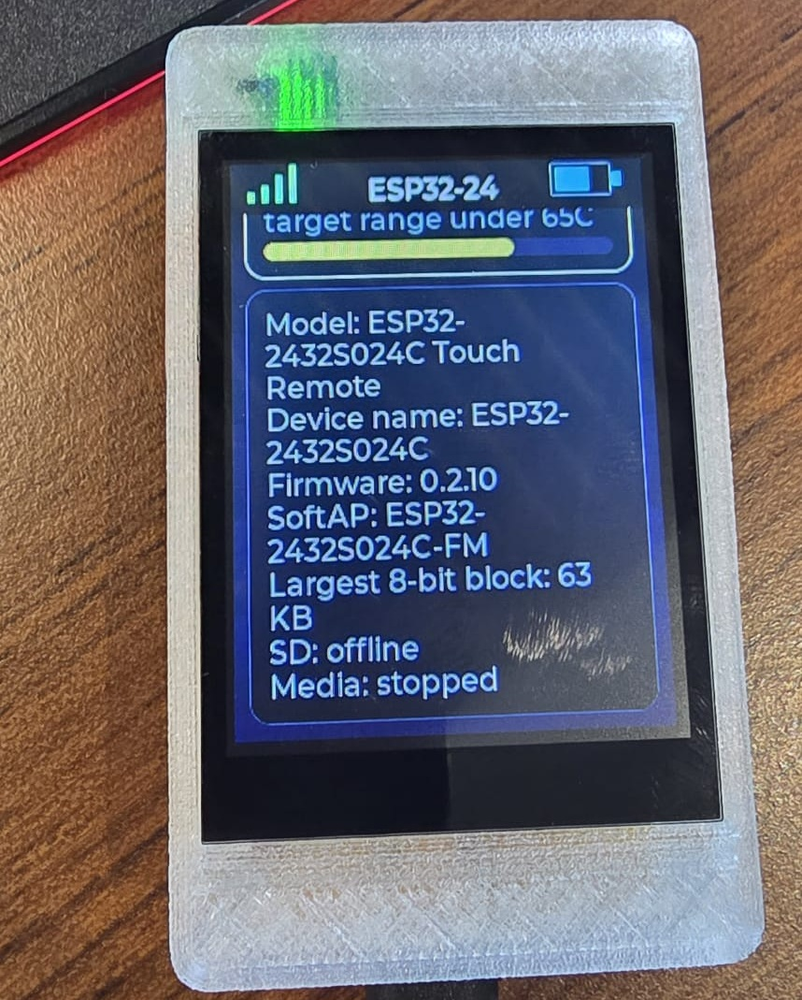
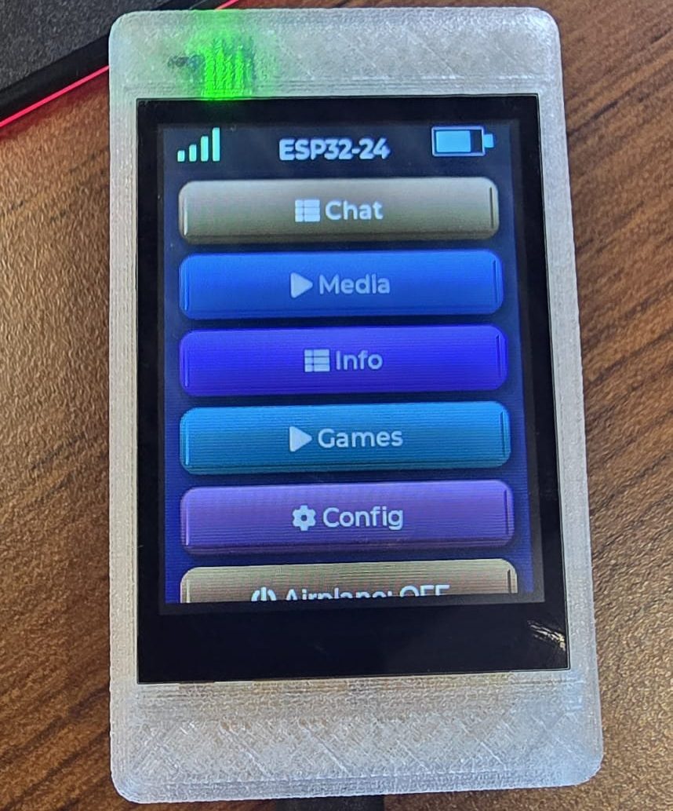
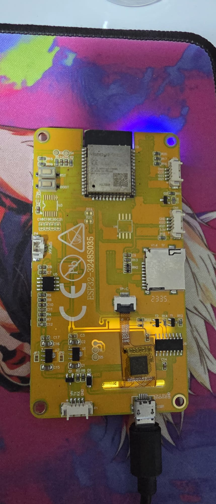
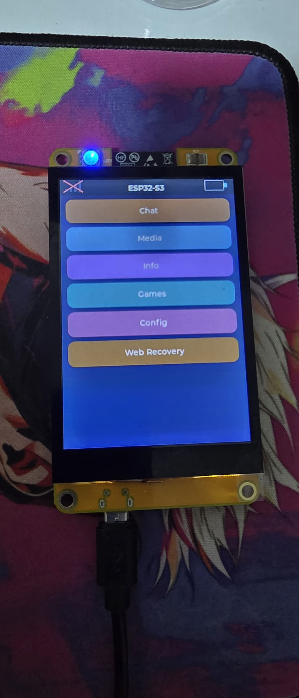
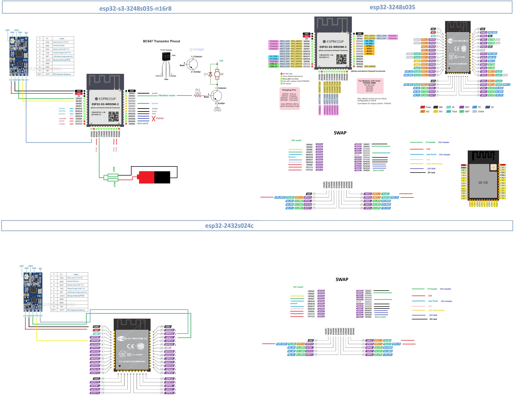
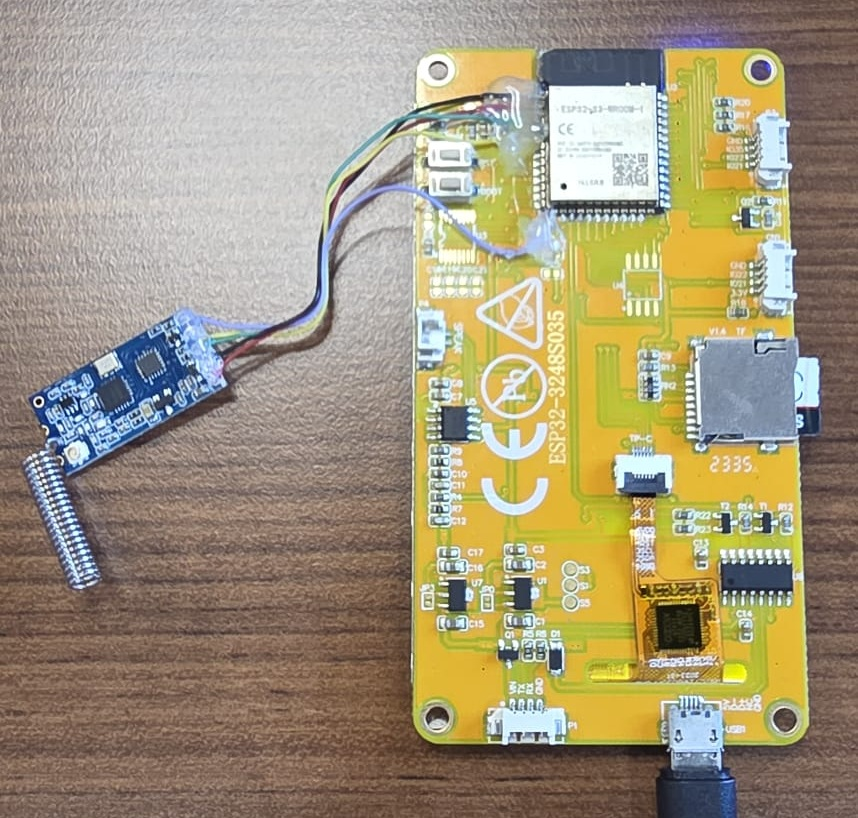

# ESP32 Touch Remote

Firmware for Sunton-style ESP32 touch display boards with an LVGL touch UI, Wi-Fi/AP management, SD-backed recovery tools, MQTT controls, and encrypted device-to-device chat.

Current firmware version: **`0.2.10`**

Supported boards:
- `ESP32-2432S024C` (`240x320`, `ILI9341`, `CST820`)
- `ESP32-3248S035` (`320x480`, `ST7796`, `GT911`)
- `ESP32-S3-3248S035-N16R8` (`320x480`, `ST7796`, `GT911`, `ESP32-S3-WROOM-1-N16R8`)


## Key Features

- Multi-board firmware with board-specific display and touch support selected at build time
- LVGL touch UI with live swipe-back navigation, delayed click feedback, and global double-tap sleep
- Reorderable menus and submenu items with press-and-hold drag, persisted order, and raised/pressed button themes
- `Style` menu now includes a persisted `3D Icons` switch that toggles between custom embedded menu icons and LVGL built-in symbols
- LVGL touch/UI hot paths trimmed to reduce callback and off-screen refresh overhead
- Discovery-gated device pairing with accept/reject confirmation on the target device
- Saved backlight brightness, speaker volume, and RGB LED intensity controls in `Config`
- Speaker volume now uses an exponential response curve for finer low-volume control
- Brightness, volume, and RGB slider values are persisted in `Preferences`
- `WiFi Config` screen with current network info, manual scan, saved-network actions, and editable AP SSID/password
- `HC12 Config` submenu with live channel, baud, mode, power, default-reset, dedicated `Info`, and `Serial Terminal` pages for the HC-12 radio module
- `OTA Updates` screen with boot-time and periodic update checks, update-available indicator/popup, progress bar, and post-update confirmation
- `MQTT Config` screen for broker settings, status, and connection control
- Home and `Config` menu entries can use dedicated embedded icons, including custom `WiFi Config` and `MQTT Config` icons when `3D Icons` is enabled
- SD recovery browser that can browse all rooted SD folders
- SD-backed chat history stored per contact under `/Conversations`
- Encrypted peer-to-peer LAN chat over UDP
- Encrypted global chat relay over MQTT
- On-device peer discovery, pairing, unpair, enable/disable, unread markers, and conversation actions
- Incoming chat messages can trigger a simple speaker notification beep on supported board audio outputs
- Built-in `Snake`, `Tetris`, `Checkers`, and PSRAM-only `Snake 3D` games with a shared touch control layout
- `Checkers` supports both local play against the ESP32 and contact-invite multiplayer started from chat
- `Checkers` includes American, International, Russian, Pool, and Canadian/Sri Lankan rulesets
- `Snake`, `Tetris`, `Snake 3D`, and `Checkers` save scores or win counts in `Preferences`
- `Snake 3D` is enabled on the `ESP32-S3-3248S035-N16R8` target with a software-rendered chase camera prototype
- `Info` screen with battery, Wi-Fi, light, CPU, SRAM, PSRAM, and SD usage indicators
- S3 build uses PSRAM-first allocation for LVGL, swipe-preview snapshots, and major UI/work buffers to reduce internal SRAM pressure
- Swipe-back and scroll gestures are filtered to avoid triggering button clicks while navigating lists and menus, including dense vertical button lists
- Screensaver now renders the exact `esp32-eyes` eye geometry adapted to each supported display resolution

## Supported Hardware

### `ESP32-2432S024C`





Display:
- Driver: `ILI9341`
- Resolution: `240x320`

Touch:
- Controller: `CST820`
- Bus: I2C
- Address: `0x15`

### `ESP32-3248S035`

Display:
- Driver: `ST7796`
- Resolution: `320x480`

Touch:
- Controller: `GT911`
- Bus: I2C
- Common addresses: `0x5D`, `0x14`

Board references used while adding `ESP32-3248S035` support:
- https://homeding.github.io/boards/esp32/panel-3248S035.htm
- https://github.com/ardnew/ESP32-3248S035

### `ESP32-S3-3248S035-N16R8`

This firmware also supports swapping the original `ESP32-WROOM-32` controller for an `ESP32-S3-WROOM-1-N16R8` (`16 MB flash`, `8 MB PSRAM`) on the `3248S035` hardware.

Build target:
- `esp32-s3-3248s035-n16r8`

Custom PlatformIO board file:
- [`boards/esp32-s3-devkitc1-n16r8.json`](boards/esp32-s3-devkitc1-n16r8.json)

Swap photos:




## Pin Mapping

### `ESP32-2432S024C`

Display:

| Signal | GPIO |
|---|---|
| `TFT_MOSI` | 13 |
| `TFT_MISO` | 12 |
| `TFT_SCLK` | 14 |
| `TFT_CS` | 15 |
| `TFT_DC` | 2 |
| `TFT_BL` | 27 |
| `TFT_RST` | `-1` |

Touch:

| Signal | GPIO |
|---|---|
| `TOUCH_SDA` | 33 |
| `TOUCH_SCL` | 32 |
| `TOUCH_RST` | 25 |
| `TOUCH_IRQ` | 21 |

SD Card:

| Signal | GPIO |
|---|---|
| `SD_CS` | 5 |
| `SD_MOSI` | 23 |
| `SD_MISO` | 19 |
| `SD_SCK` | 18 |

Audio, LEDs, Sensors:

| Function | GPIO / Value |
|---|---|
| Audio DAC left (I2S port 0) | 26 |
| RGB R | 4 |
| RGB G | 17 |
| RGB B | 16 |
| RGB mode | active-low |
| Battery ADC | 35 |
| Light ADC | 34 |

### `ESP32-3248S035`

| Signal | GPIO |
|---|---|
| `TFT_MOSI` | 13 |
| `TFT_MISO` | 12 |
| `TFT_SCLK` | 14 |
| `TFT_CS` | 15 |
| `TFT_DC` | 2 |
| `TFT_BL` | 27 |
| `TFT_RST` | `-1` |

Touch:

| Signal | GPIO |
|---|---|
| `TOUCH_SDA` | 33 |
| `TOUCH_SCL` | 32 |
| `TOUCH_RST` | 25 |
| `TOUCH_IRQ` | 21 |

SD Card:

| Signal | GPIO |
|---|---|
| `SD_CS` | 5 |
| `SD_MOSI` | 23 |
| `SD_MISO` | 19 |
| `SD_SCK` | 18 |

Mount/recovery SPI speeds:
- `8 MHz`
- `4 MHz`
- `1 MHz`

Audio, LEDs, Sensors:

| Function | GPIO / Value |
|---|---|
| Audio DAC left (I2S port 0) | 26 |
| RGB R | 4 |
| RGB G | 17 |
| RGB B | 16 |
| RGB mode | active-low |
| Battery ADC | 35 |
| Light ADC | 34 |

Note: RGB logical red/green are swapped in software to match the wiring used by this project.

### `ESP32-S3-3248S035-N16R8`

The `ESP32-S3` swap keeps the same panel and touch controller, but remaps the controller-side wiring in firmware.

Display:

| Signal | Original ESP32 | ESP32-S3 |
|---|---:|---:|
| `TFT_SCLK` | 14 | 19 |
| `TFT_DC` | 2 | 48 |
| `TFT_CS` | 15 | 47 |
| `TFT_MOSI` | 13 | 9 |
| `TFT_MISO` | 12 | 20 |
| `TFT_BL` | 27 | 8 |
| `TFT_RST` | `-1` | `-1` |

Touch:

| Signal | Original ESP32 | ESP32-S3 |
|---|---:|---:|
| `TOUCH_IRQ` | 21 | 42 |
| `TOUCH_RST` | 25 | 17 |
| `TOUCH_SCL` | 32 | 15 |
| `TOUCH_SDA` | 33 | 16 |

SD Card:

| Signal | Original ESP32 | ESP32-S3 |
|---|---:|---:|
| `SD_CS` | 5 | 38 |
| `SD_MOSI` | 23 | 1 |
| `SD_SCK` | 18 | 39 |
| `SD_MISO` | 19 | 40 |

Audio, LEDs, Sensors:

| Function | Original ESP32 | ESP32-S3 |
|---|---:|---:|
| Audio output pin | 26 | 18 |
| RGB R | 4 | reserved by octal PSRAM |
| RGB G | 17 | reserved by octal PSRAM |
| RGB B | 16 | reserved by octal PSRAM |
| Battery ADC | 35 | 7 |
| Light ADC | 34 | 6 |

Optional HC-12 UART on the `ESP32-S3` build:

| Signal | ESP32-S3 |
|---|---:|
| HC-12 `RXD` | 4 |
| HC-12 `TXD` | 5 |
| HC-12 `SET` | 3 |

Optional HC-12 UART on `ESP32-3248S035` and `ESP32-2432S024C`:

| Signal | ESP32 |
|---|---:|
| HC-12 `RXD` | 1 |
| HC-12 `TXD` | 39 |
| HC-12 `SET` | 22 |

HC-12 circuit reference:



ESP32-S3 pad wiring example using solid wires:



This photo shows one way to wire the HC-12 module directly to the ESP32-S3 module pads with solid wires for `RXD`, `TXD`, and `SET`.

Notes:
- `ESP32-S3` audio is currently disabled in firmware because the existing backend uses ESP32 internal DAC mode, which is not available on `ESP32-S3`.
- After removing the conflicting RGB output, the S3 build now boots through the normal Wi-Fi and SD initialization flow again, including saved STA reconnect, fallback AP behavior, web server startup, and SD-backed file manager access.
- The initially remapped RGB pins (`35`, `36`, `37`) collide with `ESP32-S3-WROOM-1-N16R8` octal PSRAM/flash bus pins. On this module variant, those pins must not be driven for general GPIO use, so RGB output is disabled in the S3 firmware build.
- After removing RGB output on the S3 build, boot Wi-Fi, Wi-Fi scan/connect, server startup, and SD boot mount became stable again. This points to the RGB-to-PSRAM pin conflict as the main cause of the earlier watchdog resets.
- The S3 build now uses PSRAM-first allocation for LVGL draw buffers, serial log storage, screenshot/JPEG workspace, OTA download buffers, and selected SD copy buffers.

## Defaults

### Network

- AP password: `12345678`
- Boot STA reconnect timeout: `12000 ms`

Board-specific defaults:

| Board | AP SSID | mDNS host |
|---|---|---|
| `ESP32-2432S024C` | `ESP32-2432S024C-FM` | `esp32-2432s024c` |
| `ESP32-3248S035` | `ESP32-3248S035-FM` | `esp32-3248s035` |
| `ESP32-S3-3248S035-N16R8` | `ESP32-S3-3248S035-FM` | `esp32-s3-3248s035` |

### MQTT

- Enabled: `false`
- Broker: `homeassistant.local`
- Port: `1883`
- Discovery prefix: `homeassistant`
- Default button count: `4`
- Max button count: `12`
- Reconnect period: `5000 ms`

### Power / sensors

- Battery range: empty `3.30V`, full `4.20V`
- Battery calibration factor: `0.96`
- Battery samples: `16`
- Light samples: `8`
- Display idle timeout: `120000 ms`
- Light sleep check after idle: `20000 ms`

## UI Notes

- Buttons visually react on confirmed release, not on initial touch
- Horizontal swipe-back works on supported sub-screens, tracks under the finger, and completes on release once roughly 30% of the previous screen is revealed
- Reorder drag and swipe-back now arbitrate by touch intent: horizontal motion stays swipe-back, while a mostly still long-press activates reorder
- Swipe-back is suppressed when a drag starts on sliders, switches, or scrollable UI regions
- Single tap wakes the display, and the wake tap is consumed before normal UI interaction resumes
- Double-tap anywhere while awake turns the screen off
- Double-tap sleep is ignored while the on-screen keyboard is visible
- Charging sleep animation is limited to one cycle and cancels immediately on touch
- The first frame is rendered before the backlight fades in at boot
- Tapping the top-bar antenna icon opens `WiFi Config`
- Tapping the top-bar unread mail icon jumps directly into the first unread conversation
- The top bar can show device name, Wi-Fi state, MQTT state, unread mail, and battery
- `Style -> 3D Icons` switches menu rows between custom embedded icon art and standard LVGL symbols

### Keyboard

- Shared on-screen keyboard is used across Wi-Fi, AP, MQTT, rename, and chat inputs
- Single shift tap enables one uppercase character
- Double shift tap locks uppercase until tapped again
- Tapping away or swiping while the keyboard is visible hides it first
- Double-tap sleep is disabled while the keyboard is open

### Config

- Screen backlight brightness slider with persistence
- RGB LED intensity slider with persistence
- Brightness and RGB values are restored after reboot
- Low-end brightness warning color on the slider
- Device rename field with persistence
- Device name is shown in the top bar and shortened there when needed
- `Style` includes button theme selection, top-bar center mode, GMT timezone selection, and a persisted `3D Icons` switch

### HC-12

- `Config -> HC12 Config` opens a submenu instead of dropping directly into the terminal
- Main HC-12 page can read and change:
- channel (`CH001` to `CH100`)
- baud rate (`1200` to `115200`)
- transmission mode (`FU1` to `FU4`, shown as `Raw Mod`, `Fast`, `Norm`, `LoRa`)
- transmission power (`P1` to `P8`, with dBm shown)
- `Default` restores factory settings and then reloads current module values
- `Serial Terminal` keeps the manual UART terminal and `SET` toggle
- `Info` queries the module in AT mode and shows version, baud, channel, FU mode, power, and raw summary text
- Chat discovery now also listens on HC-12 in normal radio mode, so devices on the same HC-12 channel appear in chat lists as radio contacts
- The repository now includes an `ESP32-S3` pad wiring photo for HC-12 at [documents/HC-12_to_ESP32_S3.jpeg](documents/HC-12_to_ESP32_S3.jpeg)

## Wi-Fi and AP

`Config -> WiFi Config` includes:
- Current/saved STA network at the top
- `Disconnect` and `Forget`
- Manual `Scan` button
- Discovered AP list below the scan area
- Password popup with inline eye toggle for secured networks
- `AP Config` section with saved AP SSID and password

Notes:
- AP SSID and password are stored in `Preferences`
- Wi-Fi scanning is on-demand from the screen; it does not auto-start on page open
- Some boards/USB adapters may require manual bootloader entry to flash:
  1. Hold `BOOT`
  2. Press and release `RST` or `EN`
  3. Release `BOOT` when upload starts

## MQTT

`Config -> MQTT Config` now contains only connection-related settings:
- enable switch
- broker
- port
- username
- password with inline eye toggle
- discovery prefix
- `Save`, `Connect`, `Discover`
- status window

`MQTT Controls` is the separate screen for MQTT action-button editing.

Notes:
- Turning MQTT off disconnects it immediately, saves the flag, and trims its buffer back down
- Pressing `Connect` auto-enables MQTT and updates the status window immediately
- MQTT connection and service work were moved away from direct UI handlers to reduce stalls
- All remotes use one fixed MQTT chat namespace in firmware

## Chat

### Overview

- LAN chat uses encrypted UDP peer-to-peer transport
- Global chat uses MQTT as an encrypted relay
- Devices must still be paired first; MQTT is not an open public room
- Trusted peers are stored in `Preferences`
- Conversation history is stored per contact under `/Conversations`
- Only a small recent window stays in RAM; older history is loaded from SD
- Contacts view shows all enabled paired peers, not just peers with existing history

### Chat flow

1. Open `Chat`
2. Select a paired contact
3. Conversation opens
4. Swipe back to return to contacts
5. Swipe back again to leave Chat

Conversation view includes:
- left/right aligned bubbles by sender
- roughly `75%` max bubble width
- unread indicator mail icon in the top bar
- unread green dot on contacts
- per-message send state
- inline `Play` action for incoming `Checkers` invitations
- 3-dot menu with `Clear` and `Clear for All`

Message state:
- pending outgoing message: airplane icon on the left
- delivered outgoing message: green check icon on the left
- outgoing messages only: trash icon on the right

Per-message delete:
- trash icon is shown only on messages you sent
- deleting a sent message removes it locally
- the same delete is also propagated to the paired device over LAN and MQTT

Conversation actions:
- `Clear` removes local conversation history only
- `Clear for All` removes the whole conversation on both paired devices

### Airplane mode behavior

- Airplane mode disables Wi-Fi/AP and MQTT
- Opening `Chat` while airplane mode is on shows a popup
- `Cancel` opens Chat read-only so old messages can still be read
- `Airplane Off` disables airplane mode and opens normal Chat
- If the user types a message while blocked and presses send, the popup is shown again
- Choosing `Cancel` keeps the draft and sends it later through the normal pending queue once radios are back

### Peer management

`Chat -> Peers` shows:
- `Scan` button at the top with `Scanning...` / `Done` state feedback
- `Paired Devices` section with `Enable` / `Disable` and `Unpair`
- `Discovered` section with `Pair`

Discovery behavior:
- peers auto-announce in the background on Wi-Fi
- `Scan` forces a fresh immediate discovery broadcast
- renaming a device updates peer names on other devices by public key and refreshes open conversations too

### LAN chat setup

1. Connect both devices to the same Wi-Fi network
2. Open `Chat -> Peers`
3. Wait for discovery or press `Scan`
4. Tap `Pair` on the discovered device
5. Return to `Chat`, choose the contact, and start messaging

### MQTT chat setup

1. Pair devices first
2. On both devices open `Config -> MQTT Config`
3. Enable MQTT
4. Enter the same broker settings
5. Save or press `Connect`
6. Wait for MQTT to connect
7. Use Chat normally

MQTT chat notes:
- payloads are end-to-end encrypted per trusted peer
- broker can relay messages but cannot read them
- paired peers can communicate globally as long as MQTT is connected

## Games

- `Snake` and `Tetris` use the same bottom control layout with directional arrows and a centered play/pause button.
- Start, pause, and game-over popups are centered on the game canvas instead of the full screen area.
- `Checkers` offers `ESP32` and `Tag MP` modes.
- `Tag MP` opens a contact picker above the board, sends an invite in chat, and starts the match when the other player taps `Play`.

## SD Layout

- `/web` for the primary static UI
- `/Screenshots` for JPEG screenshots and diagnostics
- `/Conversations` for per-contact chat history

Recovery/file APIs can browse and manage any rooted SD path.

## HTTP Endpoints

### System / portal

| Method | Path | Purpose |
|---|---|---|
| `GET` | `/version` | Returns firmware version |
| `GET` | `/` | Serves `/web/index.*` or redirects into setup / recovery |
| `GET` | `/wifi` | Wi-Fi setup page |
| `GET` | `/upload` | Fallback upload manager |
| `GET` | `/recovery` | Recovery browser |
| `GET` | `/generate_204`, `/fwlink`, `/hotspot-detect.html`, `/redirect` | Captive-portal helpers |
| `GET` | `/connecttest.txt`, `/ncsi.txt` | Captive checks |

### Wi-Fi / telemetry

| Method | Path | Notes |
|---|---|---|
| `GET` | `/api/wifi/scan` | Returns scanned networks |
| `POST` | `/api/wifi/connect` | Params: `ssid`, `pass` |
| `GET` | `/api/telemetry` | Battery, light, Wi-Fi snapshot |

### Chat / peers

| Method | Path | Notes |
|---|---|---|
| `GET` | `/api/chat/messages` | Returns current conversation window |
| `POST` | `/api/chat/send` | Sends chat text to the selected peer |
| `GET` | `/api/chat/identity` | Returns device name, UDP port, public key |
| `GET` | `/api/chat/peers` | Returns trusted peers |
| `GET` | `/api/chat/discovery` | Returns discovered peers |
| `POST` | `/api/chat/discovery/pair` | Trusts a discovered peer |
| `POST` | `/api/chat/peers/add` | Adds a peer manually |
| `POST` | `/api/chat/peers/toggle` | Enables/disables a peer |
| `POST` | `/api/chat/peers/remove` | Removes a peer |

### SD / file manager

| Method | Path | Notes |
|---|---|---|
| `GET` | `/fs/list` | Optional `dir` query param |
| `POST` | `/fs/mkdir` | Param: `path` |
| `GET` | `/fs/download` | Query: `path` |
| `POST` | `/fs/delete` | Param: `path` |
| `POST` | `/fs/upload` | Multipart upload with `path` |
| `GET` | `/sd_info` | SD storage plus SD fault/recovery counters |

## SD Telemetry

`/sd_info` includes storage values and recovery counters such as:
- `sd_faults`
- `sd_remount_attempts`
- `sd_remount_ok`
- `sd_remount_fail`
- `sd_try_8mhz`
- `sd_try_4mhz`
- `sd_try_1mhz`
- `sd_force_remounts`
- `sd_auto_retries`
- `sd_last_fault_ms`
- `sd_last_remount_ok_ms`
- `sd_last_remount_fail_ms`
- `sd_last_fault_at`

Serial logs also report SD recovery events.

## Media Support

Supported audio extensions:
- `.mp3`
- `.wav`
- `.flac`
- `.aac`
- `.m4a`
- `.raw`
- `.mpga`
- `.mpeg`
- `.wave`
- `.adts`
- `.m4b`
- `.f4a`

## Build and Flash

### Requirements

- PlatformIO Core
- USB serial access to the ESP32 board

### Available environments

- `esp32-2432s024c`
- `esp32-3248s035`
- `esp32-s3-3248s035-n16r8`

### Switch boards

Run a specific environment directly:

```powershell
pio run -e esp32-2432s024c
pio run -e esp32-3248s035
pio run -e esp32-2432s024c -t upload
pio run -e esp32-3248s035 -t upload
```

Or change [platformio.ini](platformio.ini):

```ini
[platformio]
default_envs = esp32-2432s024c
; default_envs = esp32-3248s035
```

### Build

```powershell
pio run
```

### Flash

```powershell
pio run -t upload
```

### Serial monitor

```powershell
pio device monitor -b 115200
```

## Partition Map

- `ESP32-2432S024C` and `ESP32-3248S035` use [partitions_3mb_no_ota.csv](partitions_3mb_no_ota.csv).
- `ESP32-S3-3248S035-N16R8` uses the stock Espressif `default_16MB.csv` OTA layout.

## OTA Notes

- `ESP32-S3-3248S035-N16R8` supports firmware OTA using the stock 16 MB dual-slot layout.
- The two 4 MB ESP32 builds keep the larger single-app layout and therefore do not support firmware OTA flashing.
- Update availability is checked shortly after boot once Wi-Fi is connected, and then rechecked periodically afterward.

## Project Structure

- [src/main.cpp](src/main.cpp) - firmware logic, UI, touch, SD, Wi-Fi, MQTT, chat, recovery
- [platformio.ini](platformio.ini) - multi-board PlatformIO environments and display flags
- [partitions_3mb_no_ota.csv](partitions_3mb_no_ota.csv) - flash partition map
- [documents](documents) - board docs and datasheets
- [3D_Models](3D_Models) - enclosure and case files

## Future UI Reference

For future UI experiments and LVGL demo ideas:
- https://github.com/lvgl/lvgl
- https://github.com/playfultechnology/esp32-eyes

## Release Binary

Release binaries are published in GitHub Releases for this repository.
Matching staged release payloads are also kept under [`release_assets`](release_assets) before upload.
